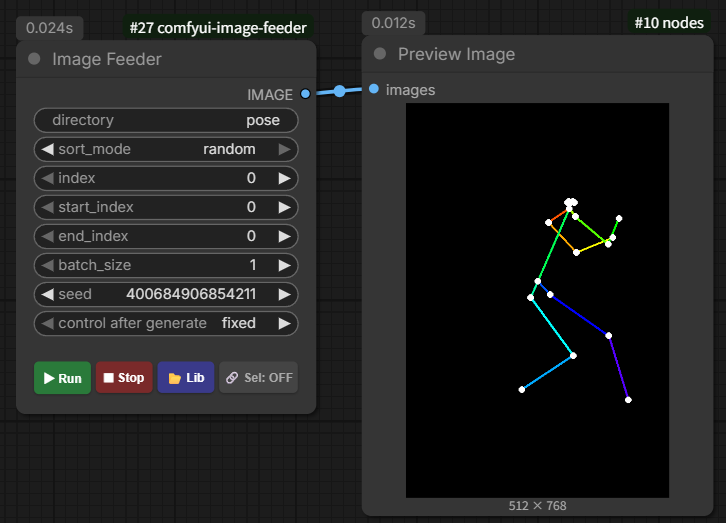
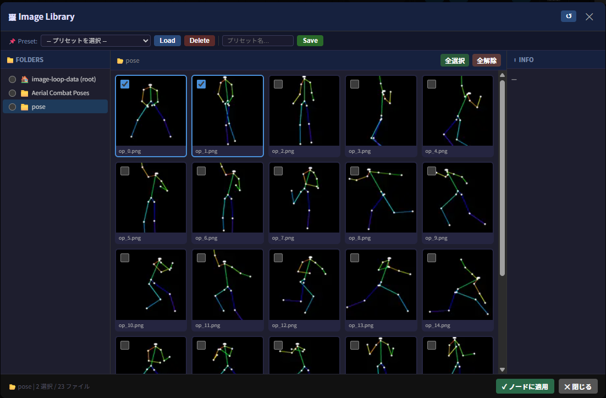

# ComfyUI Image Feeder

一款用于循环加载指定文件夹内图像的 ComfyUI 自定义节点，支持可视化图像库界面与播放控制。

**Language / 言語 / 语言:** [English](README.md) | [日本語](README_ja.md)

## 截图

### 节点外观



### 图像库



## 主要功能

- **图像库 (Lib)**:
  - 点击 📂 **Lib** 按钮打开图像库，可边预览边通过复选框逐一选择循环目标图像。
  - 三栏式界面（文件夹树 / 图像网格 / 文件信息），高效管理图像。
  - 支持预设功能，可保存并随时恢复文件夹和选择状态。

- **播放控制**:
  - ▶ **运行**: 重置索引并开始自动循环。
  - ⏹ **停止**: 停止自动循环。
  - 🔗 **选: ON/OFF**: 一键切换"仅使用库中选定图像"或"使用文件夹内全部图像"。

- **灵活排序与范围指定**:
  - 排序模式: `ascending`（自然升序）/ `descending`（降序）/ `random`（随机）。
  - 通过 `start_index` / `end_index` 指定加载范围。

- **批量输出与自动缩放**:
  - 根据 `batch_size` 批量输出图像。
  - 当图像分辨率不一致时，自动缩放至第一张图像的尺寸。

- **多语言支持 (i18n)**:
  - UI 根据浏览器语言设置自动切换。
  - 支持语言: **English** / **日本語** / **中文（简体）**

## 安装方法

1. 将本仓库克隆或复制到 ComfyUI 的 `custom_nodes` 文件夹中。
2. 启动（或重启）ComfyUI，`image` 分类下将出现 `Image Feeder` 节点。

## 图像存放位置

请按以下目录结构存放图像：

```
ComfyUI/
└── user/
    └── default/
        └── image-loop-data/        ← 根目录
            ├── pose_collection/    ← 支持子文件夹
            │   ├── img001.png
            │   └── img002.png
            └── sample.png
```

- 在节点的 `directory` 栏中输入相对于 `image-loop-data` 的路径。
- 留空则引用 `image-loop-data` 根目录下的图像。
- **安全性**: 已实施路径遍历防护，禁止访问 `image-loop-data` 文件夹以外的路径。

## 参数说明

| 参数 | 说明 |
|---|---|
| `directory` | `image-loop-data` 下的子文件夹名称，留空则引用根目录。 |
| `sort_mode` | `ascending`（自然升序）/ `descending`（降序）/ `random`（随机） |
| `index` | 当前加载位置，自动循环时自动更新。 |
| `start_index` | 加载范围的起始索引。 |
| `end_index` | 加载范围的结束索引（0 表示到末尾）。 |
| `batch_size` | 单次输出的图像数量。 |
| `seed` | 随机排序时的随机种子，用于复现结果。 |
| `use_selection` | 是否启用库中的选择（可通过节点按钮切换）。 |

## 注意事项

- 文件名中的数字（如 `img1.png`、`img10.png`）按自然顺序正确排序。
- 出于安全考虑，符号链接被排除在加载范围之外。
- 在图像库中选择图像后，请务必点击"应用到节点"按钮以使选择生效。
- 支持格式: `.png` / `.jpg` / `.jpeg` / `.webp` / `.bmp` / `.tif` / `.tiff`
